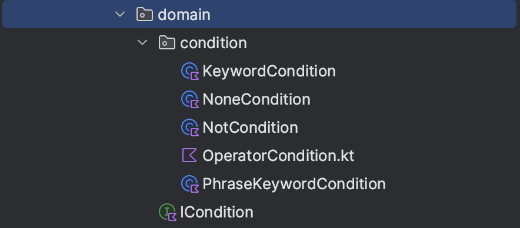

# search-query-parser-wrapper

## what is this library do

call Rust library ([search-query-parser](https://crates.io/crates/search-query-parser)) via JNI to parse complex search query into layered search conditions, so it will be easy to construct Elasticsearch query DSL or something else.

## support & requirement

* support OS: Linux, Mac(x86_64 or arm64)
* java version: 17~
* kotlin version: 1.9.10~

## how to use

add this to pom.xml

```xml
<dependency>
  <groupId>io.github.dimmy82</groupId>
  <artifactId>search-query-parser</artifactId>
  <version>1.1.42</version>
</dependency>
```

use `SearchQueryParserWrapper.SEARCH_QUERY_PARSER.parseQueryToCondition` to parse query

```kotlin
val condition = SearchQueryParserWrapper.SEARCH_QUERY_PARSER.parseQueryToCondition(
    "-(keyword or \"phrase keyword\") and (\"phrase keyword 2\" or keyword2)")

assertEquals(
    OperatorCondition(
        Operator.And,
        listOf(
            NotCondition(
                OperatorCondition(
                    Operator.Or,
                    listOf(KeywordCondition("keyword"), PhraseKeywordCondition("phrase keyword"))
                )
            ),
            OperatorCondition(
                Operator.Or,
                listOf(PhraseKeywordCondition("phrase keyword 2"), KeywordCondition("keyword2"))
            ),
        )
    ), condition
)
```

the `condition` is a multi layers construct, build by these objects

